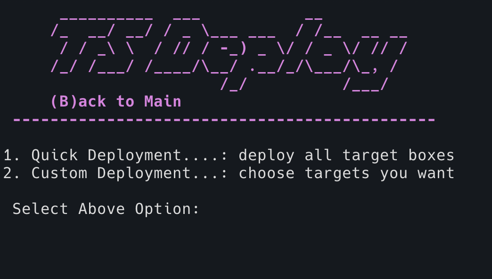

# Deployment

Once you have all the requirements installed and the project code staged locally, it's finally time to deploy your detection range.

## Station Control Intro

 

 

Thremulation Station comes with a terminal control interface called `stationctl`. It is used to perform most major tasks within the environment. An overview of some of the tasks provided are:

- configure and deploy a range
- check the status of a current range
- management tasks on a current range
    - reloading / rebuilding boxes
    - data reset (clearing indexes)
    - various troubleshooting steps

 

!!! warning "Warning"
    `stationctl` is a script located in the vagrant directory, and **must be executed from** `<project>/vagrant`!

### Launching the CLI

Let's start up `stationctl` for the first time to prepare to deploy. 

1. Ensure that you're in the project's vagrant directory, ex: $ `cd thremulation-station/vagrant`
1. Execute the Station Control script: $ `./stationctl`
1. To enter the "Deployment" menu select option `2`

> **Note:** To exit the CLI you can enter `E` to exit, or less gracefully `ctrl + c` at any time

## Deployment

A "deployment" consists of selecting the nodes (VMs) you want, downloading them, and turning them all on in sequence. There are 3 distinct types of deployments to choose from in the CLI:

 

 

- Quick - give me all the things
- Custom - choose the just the boxes you want
- Staged - more a download than a deployment for later

<!--  -->

#### Quick Deployment

A Quick Deployment is the first and fastest option. It enables all VMs included in the range, meaning the control machine, a Windows10 workstation, and a Linux server.

 

 

1. Select option #`1` and then confirm that you want to depoy this configuration and kick things off. 

1. So what's happening here? This deployment will download, turn on, and configure (provision) all 3 boxes in the order displayed.

1. Get yourself some fresh coffee, this will take 15-30 minutes, depending on your particular bandwidth available.

 

 

!!! warning "Attention!"
    This is a bandwidth-intensive task that _will_ take a while. But take heart, this is the one tax you'll have to pay, and it happens up front (and only the **first** time you deploy). Get some coffee, and drink you cup slowly, savoring these infrequently quiet moments.

> **Also Note:** If you don't drink coffee, I don't trust you and I'm not sure I want you having any part of this.

 
#### Custom Deployment

A custom deployment works generally the same way as quick one, but provides you the option to choose what target VMs to deploy alongside the control (ts.elastomic) box. 

##### Example:
A great usecase for this would be if you're _very_ limited on hardware resources, and you only intend on emulating and detecting threats against a linux server. You have the flexibility to say (N)o to Windows and (Y)es to Linux, which would look like so:

 

 

#### Staged Deployment

The staged deployment selection process works similarly to the others, but only pulls (donwloads) the boxes you select for later playtime. 

 

---
The next page will cover establishing initial access to the conrol box.