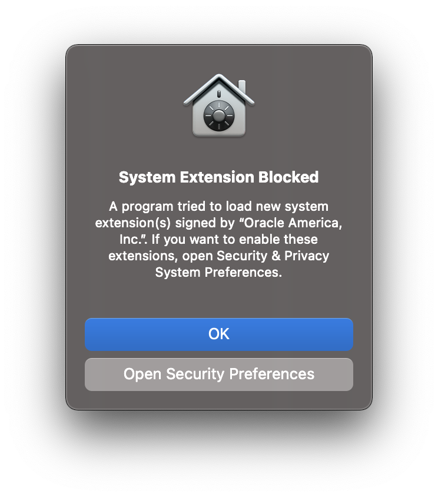
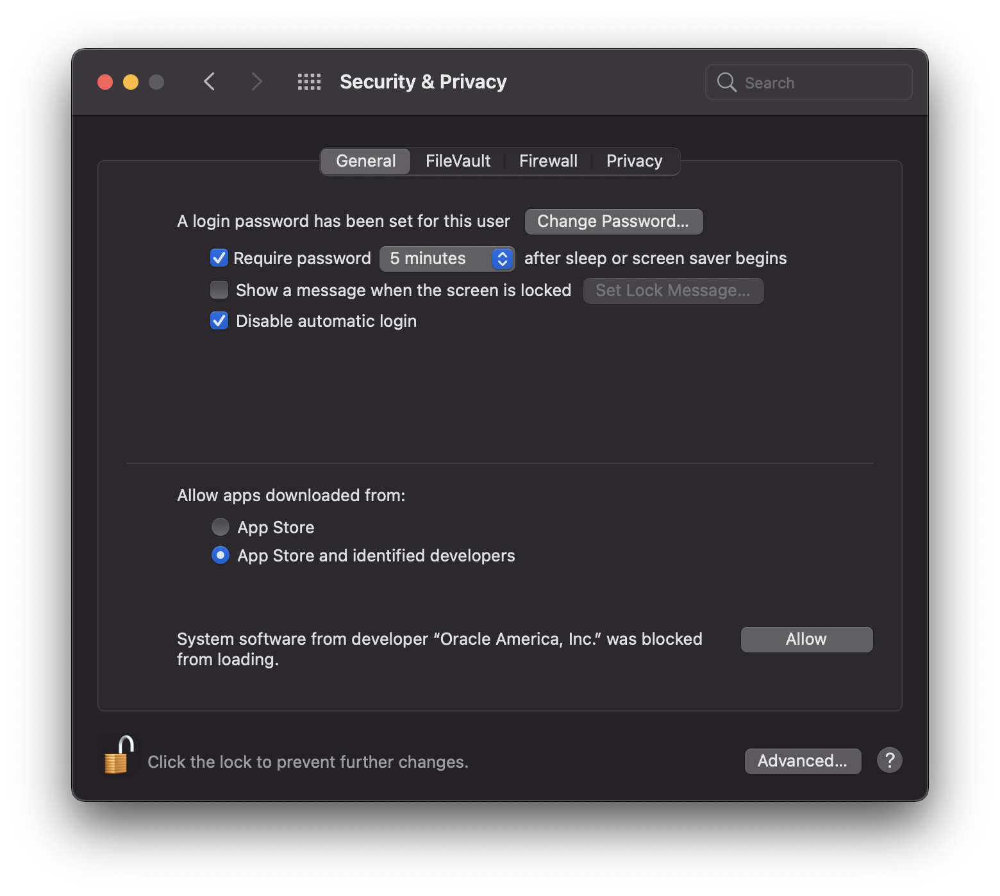

# Basic Troubleshooting Guide

Need help? This pages is where we cover some of the most common questions, and some of the issues you may run into on your way. If you have questions specific to the control script, check the [stationctl guide](stationctl.md).

## General

### macOS Virtualbox Install

In order to install Virtualbox, the software publisher must be explicitly allowed (Oracle). Use macOS "System Preferences" to proceed:

1. Click "Open Security Preferences"

    

1. Unlock the "Security & Privacy" windows and click "Allow"
1. Reboot as prompted and continue the [installation guide]()

<!-- ### Shutdown

> A.K.A "It's broken and I dont know what to fix"

Once you are done playing in your sandbox, you need to clean things up. If you are in the middle of something and want to continue later, invoke a `vagrant suspend`. Otherwise, if you are done for the day invoke a `vagrant halt`.

Last but not least, if you have goofed up your install you can use `vagrant reload`. -->

## Blue Team Tools

_coming soon_

## Red Team Tools

_coming soon_

