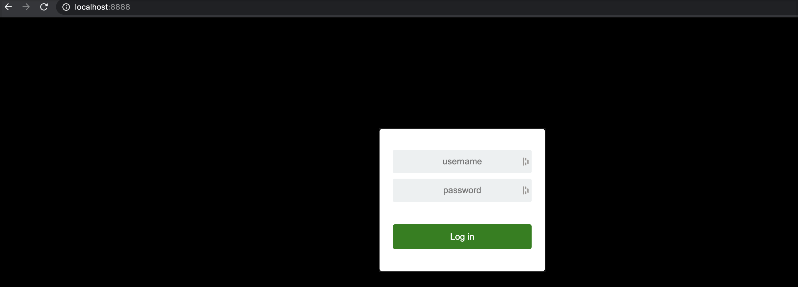
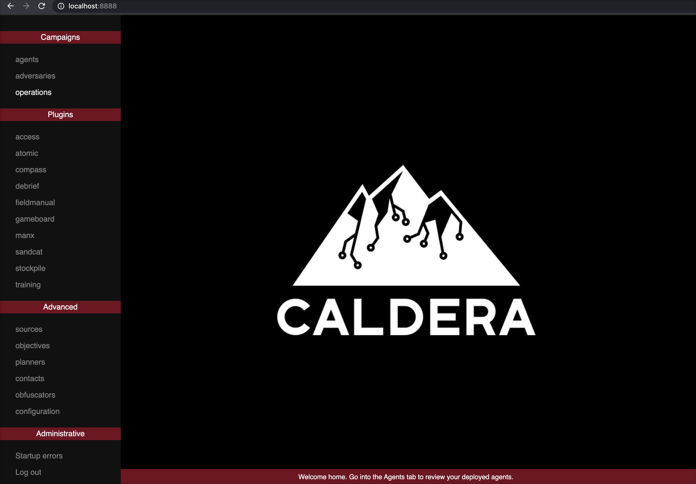
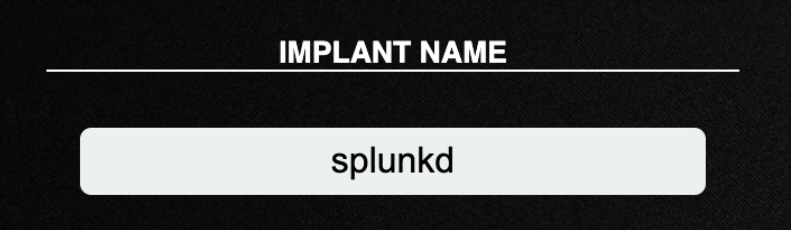
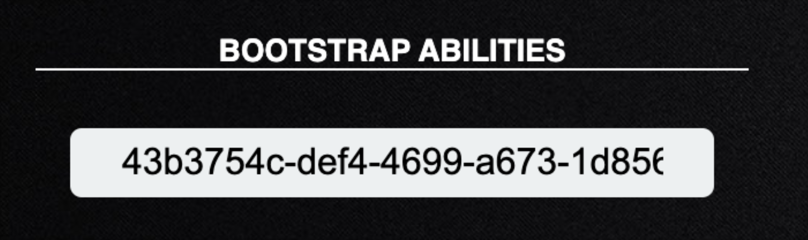
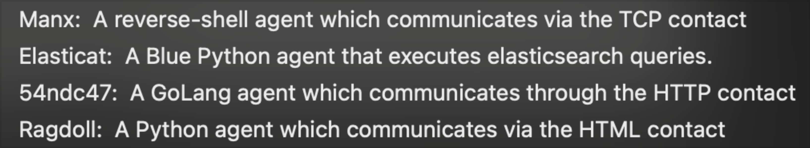
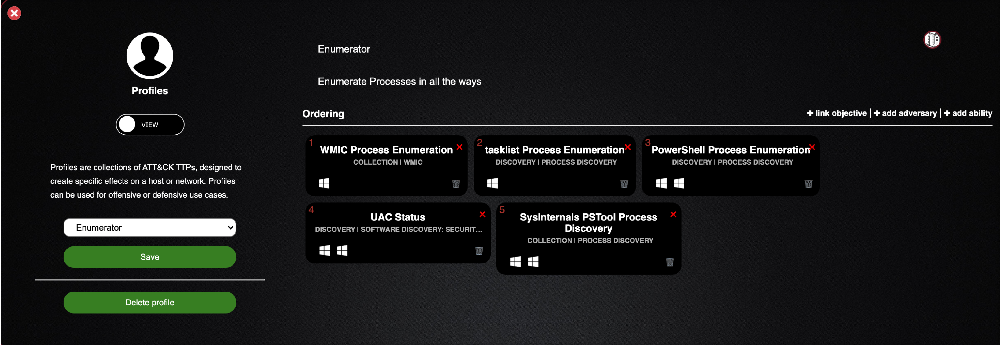
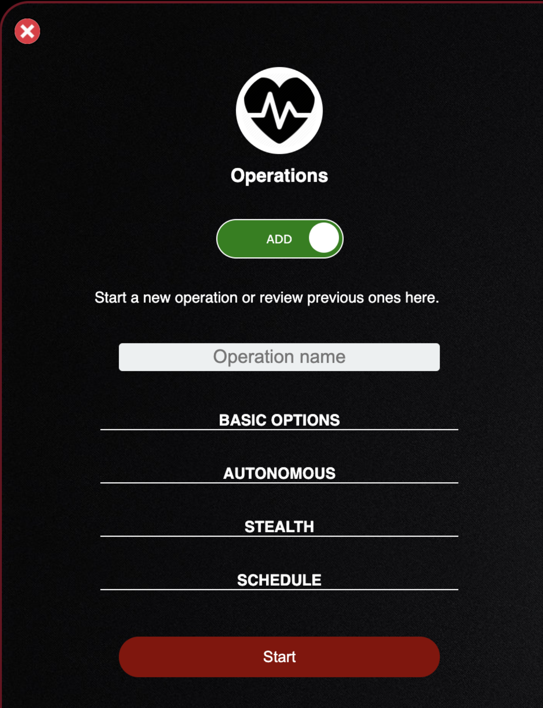
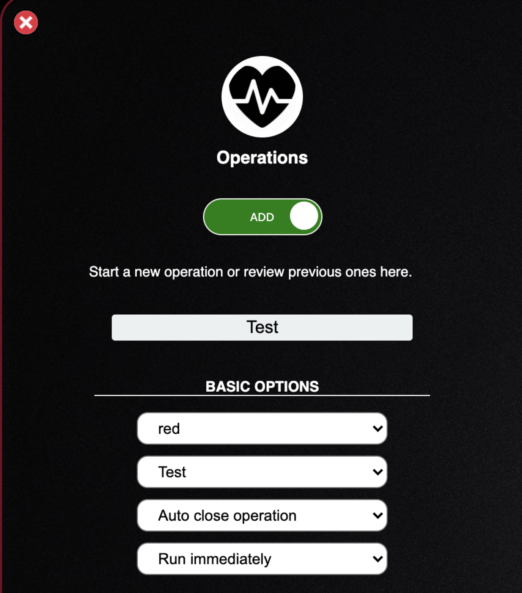

# Caldera Basic Usage Lab


### Goals
At the end of this lab you will be able to:

1. Startup the Caldera server
2. Understand and use the Caldera interface
3. Configure and deploy a Caldera agent to a “victim” host 4. View and create adversary profiles
5. Create and run an operation
6. Hunt for operation activity in Kibana

### Pre-Reqs

Let's get set up for this lab:

1. Vagrant up the elastomic and windows10 box:

    - `vagrant up ts.elastomic ts.windows10`

2. Establish an RDP session with the windows10 box with the RDPclient of your choice, with the following data:

    ```
    host:192.168.33.11
    user:vagrant
    pass:vagrant
    ```

---

## Startup

Caldera comes pre-installed on the elastomic host, and is located in the /home/vagrant directory. In order to utilize it you only need to start up the Caldera server, so let’s do that.

1. First ssh into the elastomic box with the following command: `vagrant ssh ts.elastomic`

1. Once you are ssh’d into elastomic, move into the Caldera directory: `cd caldera`

1. Start up the Caldera server by running: `python3 server.py — insecure`

1. The server startup will take at most 30 seconds, after which we can validate by pointing your local browser to `http://localhost:8888`. You should see the following:

<p align="center">

</p>
<br>

## Interface

- Now that we have our server running hosted locally, we can login and take a look around
- Default credentials for your Caldera server are: `admin:admin`
- After successfully logging in you should see the Caldera welcome page

<p align="center">

</p>
<br>

- Click on the hamburger menu next to navigate in the top left corner to dis play the different options Caldera provides

<p align="center">

</p>
<br>

- The primary menu options you will be concerned with are the Agents, Adversaries, and Operations sections.

## Agents

- We will start with the agents tab, so go ahead and click it

<p align="center">

</p>
<br>

- This tab allows us to configure, create, and deploy an agent on one of our “victim” boxes that will communicate back to our Caldera server where we can run our operations from.
- Before we create our agent, lets explore some of the up front configuration options we have available

#### Beacon Timer

Beacon timer allows you to specify how long your agent will wait to check in and send back data. By default, these values are set to 30 and 60 which is fine. You may want to change these if you are emulating a specific adversary, or just trying to remain undetected from any hunting the defender may be doing.

<p align="center">

</p>
<br>

#### Watchdog Timer

Watchdog timer lets you set the number of seconds to wait once the server is unreachable, before killing an agent.

<p align="center">

</p>
<br>

#### Untrusted Timer

Untrusted timer sets the number of seconds to wait before marking a missing agent as untrusted.

<p align="center">

</p>
<br>

#### Implant Name

The base name of newly-spawned agents. If necessary, an extension will be added when an agent is created e.g splunkd will become splunkd.exe when spawning an agent on a Windows machine.

<p align="center">

</p>
<br>

#### Bootstrap Ability

Bootstrap ability is a comma-separated list of ability IDs to be run on a new agent beacon. By default, this is set to run a command which clears command history.

<p align="center">

</p>
<br>

- Now that we understand the available configuration options, lets go ahead and generate a new agent for us to deploy to our windows10 box
- We are going to use the default values for this test, so go ahead and choose “click here to deploy an agent” button and you will see the following option

<p align="center">

</p>
<br>

- If you click the dropdown for “Choose an agent” you will see anumber of options

<p align="center">

</p>
<br>

- Each of these agents provide a brief description
- The only two I have tested are "54ndc47" and "Manxagents"
- For general purposes, use the 54ndc47 agent as it was developed directly for use with Caldera
- Choose the 54ndc47 agent and select the “Allplatforms” dropdown to choose your OS
- For this lab, we will choose windows for our windows10 host
- For the app.contact.http field,  you will supply the ip or url of your Caldera server: `192.168.33.10:8888`
- Caldera generates a Powershell command to download and execute the Caldera GoLang agent on your windows10 host

<p align="center">

</p>
<br>

- Copy that command in full and lets go over to our windows10 RDP session
- Open a Powershell prompt as administrator

<p align="center">

</p>
<br>

- Now, paste yourCaldera agent Powershell one-liner and hit enter to download and execute the agent
- Once this is done, we can go back to our Caldera server GUI
- Click the "x" in the top right corner of the agent selection box you were in, and you should now see an agent has checked into the Caldera server

<p align="center">

</p>
<br>

- Before we move on to emulating adversary activity, let's explore some of the information the agent provides us
- As you can see if gives a uniqueagent id, the host, protocol, agent, process id, and if the agent is running in a privileged context or not.

- But if we click on the green process id, we can see a lot more details

<p align="center">

</p>
<br>

- We have a much more detailed view of our agent to include parent process id, location of our executable, and the user we are running as
- Wealsoaregiventheabilitytoeditcertainfieldsdenotedby*andkill our agent
- Nowclickthexinthetoprighttoleavethisview


## Adversaries

- Select the hamburger menu in the top left of your screen and click the adversaries tab which will open and drop you down to the following screen

<p align="center">

</p>
<br>

- As you can see the adversaries tab, allows us to create our own custom profile (adversary) or view the profiles already created within Caldera
- Let's take a look at a pre-made adversary profile so we can explore what makes up a profile
- Click the “Select an existing profile” dropdown and select the Enumerator profile

<p align="center">

</p>
<br>

- Enumerator is the name of the profile
- Enumerate Processes in all theways is a description of the profile
- Beneath ordering you can see the choose TTPs and in what order they are to be executed
- These are the basic building blocks of an adversary
- Lets look at what one of these TTPs looks like up close
- Click on the WMIC Process Enumeration block, andyoushouldseethe following screen

<p align="center">

</p>
<br>

- We can see everything about this specific TTP: unique id, name, description, tactic, technique id, and technique name.
- Below the generic information, you can see what platform it is compatible with and what is being utilized to execute this technique
- Scroll down further and you will see the command that is being executed, along with a cleanup command and timeout value
- Now, click the "x" in the top right corner of the screen and we will create our own profile to execute on our “victim”
- Under profiles, change the slider from "view" to "add"

<p align="center">

</p>
<br>

- I’m going to use the profile name of "Test" but you can use whatever name you like
- Next, I will fill out a clear description e.g. “a set of TTPs for displaying Caldera’s functionality”

<p align="center">

</p>
<br>

- Let's add some abilities to our profile
- Click the +add ability selector on the right side of your screen, which will pop up a familiar menu
- Let's select a TTP: discovery tactic, T1007 System Service Discovery, and Discover System Services ability

<p align="center">

</p>
<br>

- If you scroll down, you will see the command being run is the Powershell cmdlet `Get-Service` executed by Powershell as evidenced by the psh executor
- Click the green add to adversary button in the bottom left of the screen to add this TTP to our profile
- You can see we now have added this TTP as the first step in our attack

<p align="center">

</p>
<br>

- I’ve added a second attack ability -- you can add as many as you wish, but for my purposes here this will be fine
- Save this profile and move on to executing it with our agent on the windows10 box
- Once saved, you will see "Adversary Saved"!

<p align="center">

</p>
<br>


## Operations

- Scroll up and click the hamburger menu in the top left of the Caldera interface, and select the Operations tab to display the following screen:

<p align="center">

</p>
<br>

- There are currently no operations created, so clicking the“Operations” dropdown will not display anything... so let's create our own operation
- Click the slider to change it from view to add
- This allows you to specify a number of options in order to configure your operation successfully

<p align="center">

</p>
<br>

- I will name it "Operation Test"
- Click Basic Options and we'll cover what this provides:

<p align="center">

</p>
<br>

- The first dropdown sets your group and by default all agents are added to the “red” group which is what I have selected
- The second dropdown sets the profile you would like this operation to run. I have selected the Test profile I created earlier
- The third dropdown sets the option to close this operation orleave it open for future execution. I have set this to auto close since this is a lab
- The last dropdown sets the operation to run immediately after starting, or pausing for you to inspect it. I have set it run immediately
- Click Basic Options to close it and click Autonomous

<p align="center">

</p>
<br>

- The first dropdown sets the operation to run autonomously or manually with approval of each TTP executed
- The second dropdown sets which planner you will utilize to execute the operation. A planner is a module within CALDERA which contains logic for how a running operation should make decisions about abilities to use and in what order
- The final dropdown sets the facts you will use during the operation. A fact is an identifiable piece of information about a given computer. Facts are directly related to variables, which can be used inside abilities
- Now click "Autonomous" to close it and click on "Stealth"

<p align="center">

</p>
<br>

- The only dropdown here allows for you to select a number of obfuscation techniques to obscure the commands you run on the host system
- The second field sets the jittervalue. Agents normally check in with CALDERA every 60 seconds. Once they realize they are part of an active operation, agents will start checking in according to the jitter time, which is by default 2/8. This fraction tells the agents that they should pause between 2 and 8 seconds (picked at random each time an agent checks in) before using the next ability
- The visibility slider lets you set how stealthy your operation will remain. How visible should the operation be to the defense. This defaults to 51 because each ability defaults to a visibility of 50. Abilities with a higher visibility than the operation visibility will be skipped
- Click Stealth to close it
- Don’t click Schedule. Schedule allows for scheduling this operation for a later time, which we will not be doing in this lab
- Now click start to begin you roperation and select include agent output

<p align="center">

</p>
<br>

- There is a lot here, but much of it is self-explanatory
- The first option to note is the ability at the top of the screen to stop, pause, play, and skip the operation
- Another option is the ability at any time to switch your operation from an autonomous to a manual one
- Now we can see that our Discover System Services ability was executed on the host and since we enabled the inclusion of agent output if we can click the star at the end of the ability line we should be able to see the output from the command

<p align="center">

</p>
<br>

- Click the x in the top right corner to return to the operation screen
- Congratulations!! You have successfully deployed an agent, created an adversary profile, created an operation and run that profile against a host.
- Now, let's cleanup up the range environment

## Clean Up

- Normally you might want to save all operations and profiles you create, but in this instance we'll get rid of them so you can start fresh
- First, we will delete this operation. Go ahead and click the green delete button located under download report which will revert your screen back to the original operations screen
- Next, click the x in the top left corner of the operations tab to remove it from your interface
- You should now be on the profiles tab which you can do the same thing in. Click the green delete profile button, click ok and then the red x in the top left hand corner
- For the final piece, lets kill our agent and remove it from the agents tab
- Click the green agent PID and select kill agent then select ok
- Wait for the agent PID to turn red or refresh the Caldera browser tab and go back to the agents tab. This may take a minute or two depending on the agents configuration
- Once the agent shows as terminated, click the red x at the end of it to remove it from your view and you are all cleaned up....aside from one thing. The windows box.
- If you want to ensure a clean windows box you can use the stationctl management menu to perform a soft reset and revert the windows box back to a clean instance taken upon deployment


## Thrunting

- Now lets switch over to our Kibana session and go to the Discover tab. Select the `logs-*` index

<p align="center">

</p>
<br>

- The best way to view the activity we conducted on our host is to filter down the data to just want we want to see in this case I want to see process creation events and I want to display the user, parent process name, executing process name and command line.

- Since the agent we used was named "Splunkd", filtering down the wanted activity will be easy.

<p align="center">

</p>
<br>

Let's walk through what's been done here:  

- I've filtered the data set using the winlog channel field which contains the different event subscriptions we have available to us. Since we want a specific windows event ID, I chose the Security channel.

- I then wanted to specify the process creation event id of 4688, which I did by utilizing the event.code field.

- Lastly, I knew the name of my implant was Splunkd so I filtered on the parent process name field to specify the Splunkd process name

- To view the specific fields I wanted to see, I can simply search for the field names on the left hand side and added them to my table

- As you can see, we have this Splunkd.exe spawning Powershell.exe as the user vagrant on the windows10 host to run the Get-Service command

- There are a number of different detections we could write for this, but that is a lab for another day.

---

## Conclusion

Hopefully this lab helped you gain a basic understand of Caldera, how a C2 framework works and how to hunt the activity Caldera conducts using Kibana.